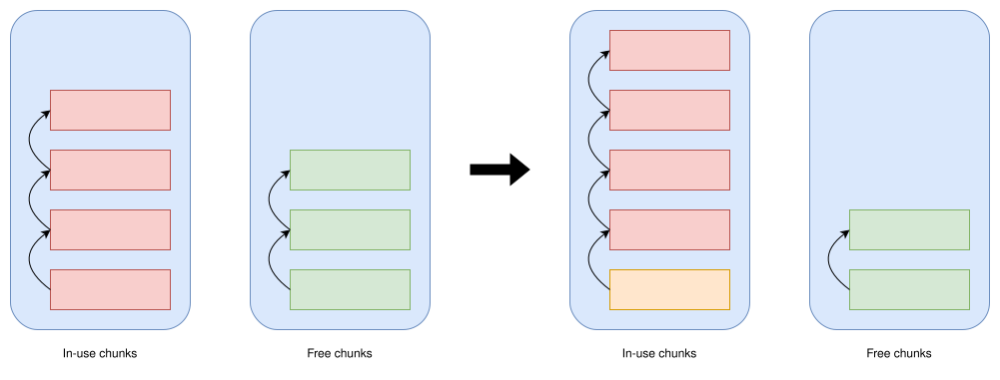
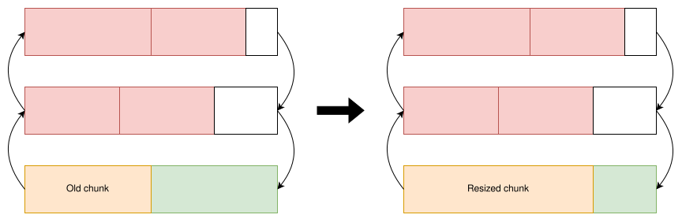

+++
title = "My personal strategies for arena allocation"
date  = "2024-06-20"
+++

A drawback that people often mention when programming in C is the lack of RAII.
This is sometimes good as it causes me to avoid small, random allocations and
incentivize grouping data into large, contiguous memory regions to make them
faster and more manageable. However, small, random allocations are sometimes
unavoidable, and there should still be a way to manage them. Instead of
grouping data into arrays, we can instead group data by their *lifetime*, and
this is where the "arena" allocator comes in.

<!-- more -->

The arena allocator has many names, such as linear allocator and region-based
allocator. It's not a specific allocator (like jemalloc), but a method for
allocating and managing memory. In my opinion, the management part is more
important than the allocation part. Because it supposedly solves some
shortcomings of C. The main idea is that instead of deallocating individual
memory, the arena allocator frees everything at once, hence all items have the
same lifetime.

# Allocator features

Another benefit of arenas are its simplicity and speed, but I won't capitalize
too much on them. My implementation will be a bit heavier than the typical
arena allocator, but it supports the following features:

1. No maximum capacity, use as much memory as it needs
2. `O(1)` Bulk reset (mark all allocated memory as free for future allocation)
3. Can allocate items of any size
4. Reallocation

## Dynamic capacity

To support the first feature, the allocator needs a "back-end" allocator,
instead of just using a static buffer to allocate memory from. It doesn't have
to be a general-purpose allocator; you can use a page-level allocator, such as
`mmap`. We will call the memory allocated with the back-end allocator "chunks".
Because the allocator needs to free everything at once, it has to keep track of
all chunks, so they are stored in a linked list. When there isn't enough memory
to fulfill an allocation request, a new chunk is created, appended to the end
of the list, and used for subsequent allocations.

<figure>
    
    <figcaption>Example of the allocator allocating memory</figcaption>
</figure>

In the visualization above, the green space is the memory available for
allocation. The red space is the previously allocated memory. And the white
space is the unused (fragmented) memory. We ignored some details here, such as
alignment, but the idea is still the same. To reduce the proportion of the
fragmented region, we can make the chunk size a lot bigger than the average
allocation size.

## Reset operation

This operation is the main feature of the allocator. It's like garbage
collection, except it assumes that everything is no longer being used and
collects everything. This assumption greatly simplifies the problem, but it
requires a paradigm shift in memory management. The easiest way to implement
bulk reset is to traverse the linked list and free all chunks. But as mentioned
earlier, the operation needs to have constant time complexity. To achieve this
and make allocating chunks more efficient, we keep track of a list of free
chunks. We can use the linked list structure of the chunk for the free list
itself!

<figure>
    
    <figcaption>Example of getting a chunk from the free list</figcaption>
</figure>

With this new "chunk allocator", the back-end allocator is only called when the
free list is empty, so allocation speed is further improved. Now, to mark all
allocated memory as freed, all we have to do is concatenate the in-use list
with the free list and set it as the new free list. The in-use list then
becomes empty. To concatenate two lists in `O(1)`, singly linked list is not
enough, so I added a tail pointer to the in-use list. Concatenation is now as
simple as linking the tail of the in-use list with the head of the free list.

## Arbitrary sized allocation

With this architecture, you might be wondering: What if the allocation request
is bigger than the chunk size? The solution is very simple: we allocate an
entire chunk to fulfill the request. To reduce fragmentation, the new chunk is
stored *behind* the current chunk, so the current chunk and its available
memory can still be used.

<figure>
    
    <figcaption>Example of allocation a region larger than the chunk size</figcaption>
</figure>

This means that the chunks are now variable-sized. So I had to also store the
capacity of each chunk so that a big chunk can be reused for multiple small
allocations. But how do you allocate a chunk big enough for the request? Here
are some ways of solving this:

**Option 1:** Store the static-sized chunks and the variable-sized chunks in
two different free lists with different data structures. The static-sized
chunks can still use a linked list, but the variable-sized chunks can use
either a [meldable heap](//en.wikipedia.org/wiki/Mergeable_heap) or a [search
tree](//en.wikipedia.org/wiki/Search_tree). These data structures try to avoid
invoking the back-end allocator. The heap does this by always getting the
biggest region, while the search tree can get the smallest region that fits the
request. Obviously, the search tree is better for reducing fragmentation than
the heap, but remember that when we reset the arena, we need to combine the
in-use list and the free list, which the meldable heap can perform more
efficiently (hence the name).

**Option 2:** Store the static-sized chunks and the variable-sized chunks in
the same linked list. This method has the benefit of
being simple and still supports `O(1)` bulk reset, but it will invoke the
back-end allocator more often. To allocate a big chunk with this method, when
the free list is not empty, detach the first chunk from the free list. If it
doesn't fit the request, deallocate it and use a chunk allocated with the
back-end allocator; otherwise, use it. This means that every time the back-end
allocates a chunk, a chunk in the free list is deallocated.

Because I prioritized `O(1)` bulk reset, I chose to implement the second
option. Yes, the [Fibonacci heap](//en.wikipedia.org/wiki/Fibonacci_heap) can
merge in `O(1)` amortized time complexity, but I don't think the complexity and
overhead of the Fibonacci heap are worth it. Another interesting data structure
is the splay tree, which can adapt to the allocation pattern, but merging two
splay trees is an `O(n log n)` operation, which is not ideal. For some other
usage, these data structures may be better, but for now, I'm using the easy
method.

## Resize allocated memory

For me, this operation is very important, as I frequently use dynamic
array-based data structures. It might be better to let dynamic arrays have
their own lifetimes, but recently I encountered a situation that requires me to
group the lifetimes of multiple dynamic arrays and other objects. It's an
operation vital enough for me to drastically change the structure of the
allocator to accommodate: I have to switch to a doubly linked list. There are
**3 cases** for resizing:

### Case 1

In this case, the memory region is bigger than the fixed chunk size. From the
allocation strategy above, the region has an entire chunk for itself. So to
resize, we can just resize the chunk with the back-end allocator. Then we have
to update the pointers correctly, which is why we need a doubly linked list.

<figure>
    
    <figcaption>Example of resizing a region larger than the chunk size</figcaption>
</figure>

As shown in the figure above, the resized chunk may be stored somewhere else in
memory, so the next and previous nodes in the list are invalidated. So we have
to follow the pointers to get to them and link them back. This operation can
work without, but benefits from, a back-end allocator with an efficient resize
operation, such as `realloc`.

### Case 2

In this case, the memory region that you want to resize is the previously
allocated region, and there is enough space in the current chunk to expand it.
Resizing now is just shifting the border between the allocated region and the
available region. The only modification required for this is that we now have
to store the pointer to the previous allocation.

<figure>
    
    <figcaption>Example of resizing the last allocation</figcaption>
</figure>

This may sound specific, but resizing the last allocation is more frequently
used than you think. It's common to initialize an array by pushing a variable
amount of items into it, then never change the size afterward. If the array
also happens to be the first region in the chunk, when the size exceeds the
fixed chunk size, it automatically switches to case 1 resizing without any
memory fragmentation.

### Case 3

When the conditions for the previous cases are not met, we have to fall back to
a simple resizing strategy: Allocate a new region of memory and copy the data
from the previous memory to the new one. This is an expensive operation; the
old chunk can't be reused (for future allocation), so it should be avoided. But
in some cases (like for dynamic arrays), it is tolerable to do this.

# Programming Interface

So those are the characteristics of the allocator. It's quite big and
complicated, so I won't show the full code of it. But I'll show what using the
allocator feels like. This is the entire interface:

```c
Arena Arena_create(void);
void *Arena_alloc(Arena *arena, size_t size);
void *Arena_resize(Arena *arena, void *ptr, size_t old_size, size_t new_size);
void Arena_reset(Arena *arena);
void Arena_destroy(Arena arena);
```

If you're used to the general-purpose, built-in libc allocator, you might find
it weird that we have to create an arena object and pass it around to allocate
memory. Why not just have a global allocator and expose it with some functions?
Personally, I prefer passing things with internal states around, but even
without that, it is required so that multiple arenas with different lifetimes
can be created and used independently. An example of a function that allocates
memory now looks like this:

```c
Data *create_data(..., Arena *arena);
```

I think it's cool that now the function signature not only tells us that it
allocates memory, but also tell us what the lifetime of the allocated memory
is. Passing an arena into a function is like telling it to move data from its
lifetime---which ends when the function returns---to the lifetime of the arena,
using pointers that point to memory allocated by it.

# Closing

But why do we need this lifetime stuff? Well, I'm not the person to tell you
this. This article just describes my approach to arena allocation and does not
propose it. I think that you should decide whether you need to use arena
allocators, and if you do, here is one way of doing it.

Personally, I don't like this allocator too much. It's complex and depends on
another allocator. But it's extremely generic and has many features that I find
useful. I'm still experimenting with this method to see if it's stable and
actually reduces the complexity of memory management.

**Edit:** The allocator's implementation is available
[here](//github.com/ziap/arena).
