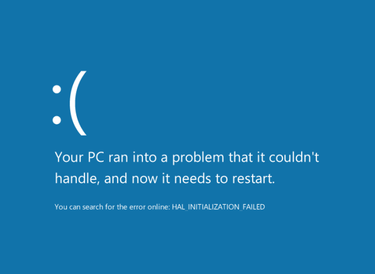
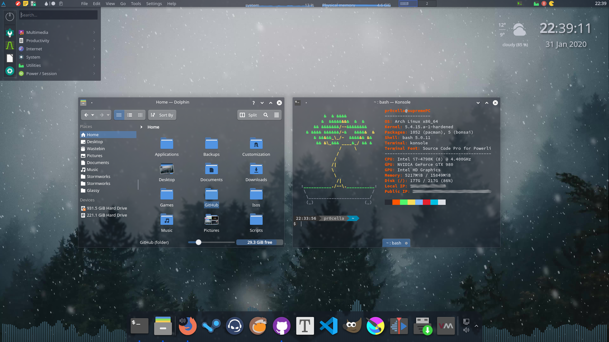

+++
title = "My desktop customization journey"
date  = "2024-12-13"
+++

I'm a massive tinkerer, I love breaking things to see why it broke and how to
fix them. I prefer breaking software because if it goes too far, I can just
reinstall everything. It was a great learning experience, and I'm glad that I
had the time and opportunity to do it. As I grow up, messing with software is
no longer just for fun and learning, it's had become a way for me to optimize
my workflow, to be more in tune with technology.

<!-- more -->

Even before I picked up programming, I customized my computer so that I can do
whatever I'm supposed to do (probably Word and PowerPoint IIRC) as efficient as
possible. Back when I was using Windows, I added custom keybindings with
[autohotkey](//www.autohotkey.com/), installing custom programs such as
[rainmeter](//www.rainmeter.net/) to make my computer looks and performs
differently. I was having a blast, but Windows has issues, which makes my
experience wasn't as good as it could be.

<figure>
    
    <figcaption>
        These Windows customization screenshot took me back ...
        (<a href="//www.reddit.com/r/Rainmeter/comments/6ueup6/firewatch_sunrise/">source</a>)
    </figcaption>
</figure>

# Problems with Windows

The biggest problem is performance. Windows is a tightly packaged product with
many interconnecting parts. You can't really modify Windows further than what
its developers intended for you to do. Some programs can hack into Windows
component and change them, but most of the time the best you can do is to add
stuffs on top of Windows, which is not great in terms of performance. Windows
being closed-source also means that these modifications, especially ones that
poke deep inside, can easily break after an update.

<figure>
    
    <figcaption>The dreadful Windows Blue Screen</figcaption>
</figure>

Other than that, I mentioned above that whenever I brick my system, I can just
reinstall everything. Windows wasn't really designed to be reinstalled every
other month. Just setting up all the regular applications (browser, text
editor, ...) was annoying, let alone customizations. Because of this, I thought
that maybe it's time for me to grow out of my hobby of customization and just
use my computer the way it was "designed" to be used.

# Switching to Linux

That was until I was introduced to Linux and especially tiling window manager.
The lightweight and open-source nature of Linux means that you can add, remove,
and modify whatever you want, and it stays performant. The options are also
much wider, there are plenty of desktop environments to choose from. When I
first started, I used KDE Plasma, and that alone gave me more customization
options than I ever had with Windows. The performance just blows Windows' out
of the water, and I have more faith that it stays working because customization
is a feature of KDE, not a hack.

<figure>
    
    <figcaption>
        A KDE Plasma
        <q><a href="//www.reddit.com/r/unixporn/wiki/themeing/dictionary/#wiki_rice">rice</a></q>,
        showcasing its customization capabilities
        (<a href="//www.reddit.com/r/unixporn/comments/ex02gi/plasma_theme_glassy/">source</a>)
    </figcaption>
</figure>

The problem of constant reinstallation was also fixed, thanks to the faster
installation process and package manager. It usually took me a few hours to
install Windows, while for Linux (Kubuntu), it only took about 30 minutes,
sometimes even faster. The package manager makes setting up applications much
faster and easier than on Windows, given that the applications that I use are
available on the package registry. And this is just the tip of the iceberg.

# Using tiling window managers

Linux desktop environments are cool and all, but I needed more customization.
Essentially, I want to create my own desktop environments. Naturally, I was
gravitated towards windows manager, especially tiling ones. The idea of
non-overlapping, non-minimizing windows organized into "tiles" and workspaces
was so eye-opening for me. And the fact that most of these window managers are
bare bone, and you are forced to **customize** them just makes them more
appealing to me.

<figure>
    
    <figcaption>
        The custom desktop I've been using for more than 3 years
    </figcaption>
</figure>

Eventually, I settled to the [setup](//github.com/ziap/dotfiles) that I used to
this day. It was configured from the ground up, gives me lots of control and
feels lightweight and fast. At this point, I have learned a bit about
programming and was comfortable with text-based configuration. This type of
configuration makes reinstalling or setting up somewhere else even easier.
After reinstalling, I just have to install all required apps with the package
manager, then just copy the configuration files to the right directory.

Satisfied with the setup was an understatement to say the least. It looks the
way I wanted it to be, it functions the way I wanted it to be, and I can
somewhat rely on it being how it is. Although I'm open to alternatives
([river](//isaacfreund.com/software/river/), [niri](//github.com/YaLTeR/niri)),
I'm extremely happy with my current setup.

# What about my Linux distribution

Note that I only mentioned the installation speed of Kubuntu, not that I used
it for my current setup. This is because Linux distributions kind of don't
matter that much. People often associate distributions with their looks, and I
used to be like that, too. But what really matter in a Linux distribution is
the package manager. Everything else, including the bootloader, the init
system, and the desktop environment are fully configurable.

<figure>
    
    <figcaption>
        Comparison of package managers except AUR and NixOS as of the time of
        writing (<a href="//repology.org/repositories/graphs">source</a>)
    </figcaption>
</figure>

The package manager determine how many packages are available to be downloaded,
and how fresh these packages are. When I started making my Sway configuration,
up until recently, I have been using Fedora and DNF because they strike a good
balance between bleeding edge and stability. However, there are some problems
with Fedora.

While setting up my dotfiles is as simple as a `cp -r`, installing required
packages isn't. I tried to write a shell script to automate that process
multiple time, but every time Fedora decided to rename or remove a package ---
which happened more than I thought ---, my script broke. This is because the
package installation process is nondeterministic, as there are no equivalents
of lockfiles for DNF. Also migrating to a newer Fedora release, while miles
better than Windows, was still a pain in the back.

# Entering the Nix rabbit hole

NixOS is something that I frequently heard about, but hesitant to give a try. I
considered a "weird distribution" like SteamOS or Alpine because they do things
differently and that difference requires special caution to work with. For
example, this is what happens when you do something perfectly normal in other
distributions: Downloading an executable and running it.

<figure>
    
    <figcaption>Me failing to run Deno on NixOS</figcaption>
</figure>

The package failed to run because it depends on a system DLL. That DLL may not
be installed or have mismatched versions, which can affect the behavior of the
executable. Such executables are called impure, and NixOS doesn't like that. So
to get around this, we have to build the application from source. In fact, the
easiest way to get an application to work on NixOS is to build it in a special
way to make Nix packages. This, and the fact that the process of building and
publishing packages are so streamlined that the Nix package manager has [the
highest number of packages](//repology.org/repositories/graphs) (as of the time
of writing).

NixOS makes me thinks a lot about software distribution, which is a topic for
another article. Let's first get back into the less serious world of software
customization. If you haven't guessed it, I migrated my setup to NixOS, and
there were some mayor improvements:

- Home manager allowed me to configure everything, even my web browser, in a
single declarative format.
- Flakes allows me to version-pin my packages in lockfiles, so if there are
breaking changes, I can still install the old version of my packages.

This addressed all the problems that I have with Fedora, even improve on things
that I didn't know I needed. Let home manager manage everything seems a bit
dangerous, so I still maintain both my normal dotfiles and my home-manager
configuration. Getting applications to work is a bit more difficult, but if
something doesn't work, I can just use a flatpak or even Windows executable and
wine.

# Conclusion

My current setup now uses NixOS and home-manager. After a few months of usage,
I can say that NixOS is amazing. It's absolutely not for the average user,
heck, you need to learn a functional programming language just to configure
your system. But NixOS had a solution for almost all of my customization
problem since using Windows about reliability and stability. I have confidence
that I can easily replicate my setup on any machine with NixOS or the Nix
package manager. And I'm sure that new updates won't break my configuration.

So that's my journey of customizing my desktop, how I went from Windows to
generic Linux to NixOS. Desktop customization never failed to give me new
things to learn, Nix even deepens my understanding of functional, declarative
programming. This is why customization is so integral to how I learn and use
technologies. Customization is often considered "unproductive" by the developer
community, but I think that finding what works for me, optimizing my workflow,
learning and generally having fun is worth the effort put into it.
