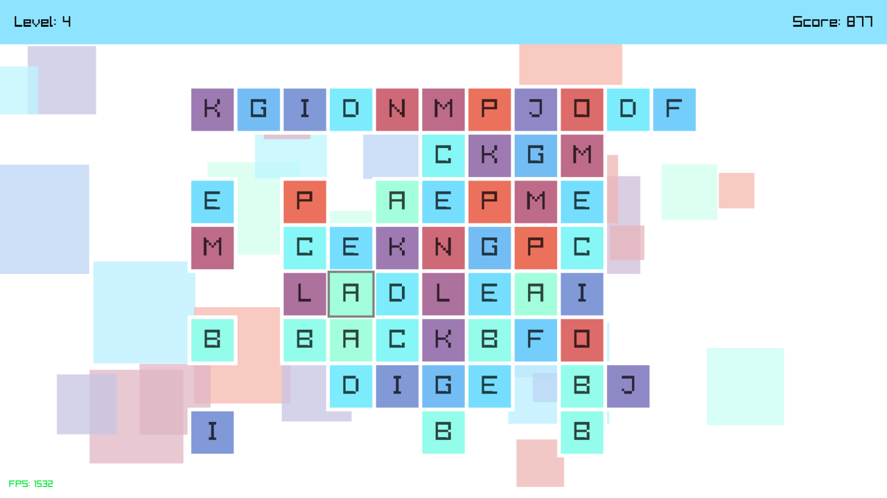
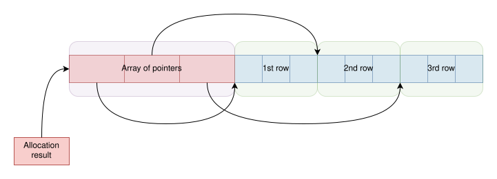

+++
title = "A game I made as a course project"
date  = "2024-05-28"
+++

I recently programmed a large chunk of the game from scratch for a university
course project. This is one of a few projects that I delivered with enough
quality and presentability. So I wanted to document my process of making it,
what I learned, and how I applied my knowledge from and outside the course.

<!-- more -->

My university teaches "Advanced Programming Techniques and Practices" after
"Introduction to Programming". This is supposedly the next step after learning
the basics of programming, as we learn mostly about dynamic memory allocation,
linked lists, and how to use them to create stacks and [queues](/blog/queue/).
At the end of the course, there's a pair-project for us to supposedly apply the
aforementioned techniques and understand their usefulness. It was fitting, as I
thought they were unnecessarily compilcated and impractical, and I went into
the project with hopes that this opinion would be changed.

# The game

Before diving into the process, let's take a look at the final result. Most of
what we created is specified as required features for the project, and only
some of them are actually my idea. This is what the game looks like:

<figure>
    
    <figcaption>A screenshot of the game.</figcaption>
</figure>

It's a puzzle game where you have to connect identical tiles with no more than
three straight lines. Based on the project description, this is a simplified
version of the [Pikachu Game](//gamevui.vn/pikachu/game), which is apparently a
very popular game among Vietnamese students because I got called out for not
knowing it. Obviously, the "Pikachu Game" is just a Pokemon-themed version of a
broader type of game. After some research, I think this type of puzzle is
called "Mahjong Connect".

The game we created has 2 game modes, 6 levels, a tutorial, an account system,
a scoring system, and a leaderboard. But most importantly, unlike my previous
game projects, it actually has a user interface. There is a user flow, and
regular people can actually play it. It also has sounds and animations, which
drastically change how it feels and make me want to invest more time into these
aspects of game development. The only downside compared to my other projects is
that there is no web support. This is because I'm required to do things that
make it hard to port the game to the web, such as file I/O for the account
system and dynamic memory allocation. Also, because my custom OpenGL/WebGL
application framework doesn't have audio playback or font rendering (yet,
hopefully). So what did I use to create the game?

# The technologies behind it

## Programming language

The game is written in C++, and compiled to both Windows and Linux. The only
reason why I use C++ is that I'm required to use it. After a long period of
writing C++, I'm quite tired of it. If I had full control of this project, I'd
have written it in plain C and be much happier. Because I don't like writing
C++, I have to use a small subset of C that C++ supports. What I really miss
are designated initializers, compound literals, and not having to type-cast the
pointer returned from `malloc`. Other than that, writing C++-compatible C isn't
too bad; I just have to tell my teammate not to use C++ features. I still
prefer using plain C just for the much more powerful initialization.

You might be wondering: without C++ features such as RAII, smart pointers and
templates, how do you structure code, prevent illegal access and memory leak?
How do you even write an entire game without these features? The truth is that
RAII and smart pointers doesn't fit inside my architecture. I don't have
granular, individual allocation, all resources have their lifetime tied to the
scene they're in. So resource management happens in parallel with scene
management, in a controlled and predictable manner. I rarely need generic code,
so the lack of template isn't a big problem. The interface pattern, which is
used extensively in scene management, is done using [tagged-unions instead of
polymorphism](/blog/polymorphism#the-alternative).

I have no problem writing the game in C++-compatible C. The game is a
non-trivial program with multiple scenes, objects, and resources to handle, and
finishing it reinforces my idea that you don't need much more than C.

## Application framework

As mentioned earlier, my custom C application framework doesn't support audio
playback or font rendering, so I decided to use an existing one. This is also a
good opportunity for me to try existing frameworks and see what is missing from
mine. In the spirit of using plain C, I chose raylib as the application
framework for this game. It's small, extremely easy to use, and good enough for
what I'm doing. The boilerplate code is virtually nonexistent:

```cpp
#include <raylib.h>

int main() {
    InitWindow(1024, 768, "App title");

    while (!WindowShouldClose()) {
        BeginDrawing();
        // Do stuff
        EndDrawing();
    }

    CloseWindow();
    return 0;
}
```

That's as easy as you can get. Of course, there are some design decisions by
raylib that I don't agree with. For example, the API mainly uses null
terminated strings instead of slices, the user manually set up the event loop
(`while (!WindowShouldClose())`), and it uses PascalCase for everything.
Nonetheless, I really like its font rendering. I only used two functions, one
for drawing and the other for measuring texts, and only those two are required
to draw texts in any alignments or arrangements.

```cpp
const char text[] = "Some text";

const int text_width = MeasureText(txt, size);

// Left align
DrawText(text, x, y, size, color);

// Right align
DrawText(text, x, w - text_width, size, color);

// Center align
DrawText(text, x, (w - text_width) / 2, size, color);
```

Because the user has full control over the alignment, they can align it however
they want, allowing for extremely flexible text layouts. I might adopt this API
for my application framework, except with slices instead of null-terminated
strings. I'm still deciding on how to render fonts; most viable option as of
the time of writing is using a precomputed SDF font atlas.

Another extremely useful function that's often used in conjunction with font
rendering is string formatting. I used `snprintf` which is, in my opinion, one
of the most useful C standard library functions. Even though it writes to
null-terminated strings, it also returns the hypothetical length, which you can
clamp with the maximum length to get the actual length of the resulting string.
And although it's a bit heavy, using it sparingly is okay, given that it's as
convenient as string interpolation in higher-level languages. Implementing a
modified version of `snprintf` is an interesting topic for a future project.

# Applied techniques

The tech behind this game is intentionally primitive to show that you don't
need much to make a full product. Even though the project goal is simple, so
that students who only passed one and a half programming courses can still make
it, I think the final result is still quite complex. This is a non-exhaustive
list of what we managed to implement:

- Core game logic
- User authentication and serialization
- Custom user interfaces written from scratch
- A Scene management system
- Lots of animations
- A tutorial

I'll briefly talk about how we implemented the game logic, the user interface,
and the animations and visuals of the game.

## Core game logic

And of course, the game logic itself is already complicated because it's a
puzzle game. I won't go into details as this part of the game is handled by my
teammate. It involves creating the data structures to represent the game,
determining if a move is legal, checking if the game is over, and calculating
the first legal move to use as a hint for the player. Most of it requires
breadth-first search, which makes this project a perfect opportunity to use [my
queue implementation](/blog/queue). When dequeueing, my queue returns a pointer
to itself if the queue isn't empty and a null pointer otherwise. This allows
for a very cool pattern to use for BFS.

```c++
Queue_enqueue(q, init);

while (Vertex *top = Queue_dequeue(q)) {
    Vertex v = *top;
    // Do something with v
    for (Vertex next : v.edges) {
        Queue_enqueue(q, item);
    }
}                
```

Because this is my own queue implementation, I got to do whatever I wanted and
using pointers as a return type instead of an iterator or a proper optional
type. In my opinion, pointers are good enough for "optional reference", and
creating a custom optional type or even using `std::optional` is useless
because C++ isn't built with them in mind, and there's no control flow to make
working with them less painful. Also I don't care about iterators. But what
about invalidation? Just dereference the pointer before modifying the queue.

## The user interface

Unlike the game logic, where my contribution ended with the queue, I worked a
lot on the user interface and animation system. When working on the interface,
the [MVC pattern](//en.wikipedia.org/wiki/Model%E2%80%93view%E2%80%93controller)
naturally came up; however, all the data for the UI and game states are stored
in a single massive struct. I'm not ashamed of doing that, as it was still
fairly easy to work with, and I didn't have to think about some form of
elaborated state management scheme. I'm super grateful that I worked with HTML
and CSS and understood the fundamentals of designing responsive layouts without
worrying about the technical details. Because of that, I was able to implement
the UI for the game from scratch with specific requirements that match what I
knew. I might consider doing more higher-level stuff to better understand the
requirements of lower-level systems.

UIs are somewhat daunting to tackle, as there are tons and tons of cases to
consider. How to handle focus or hover, how to edit text boxes with keyboard
inputs, how to implement checkboxes, radio buttons, and millions of other types
of widgets. And most importantly, how to implement them in a way that's
correct, extensible, maintainable, and performant. But a basic UI is really not
that hard, and game UIs have a much more relaxed set of requirements than
general UIs.

I haven't written UI before because they require font rendering, which I have
yet to implement, and also because I was daunted, and writing them seems like a
chore compared to the other more exciting game logic stuffs. I'm glad that this
time I decided to let my teammate work on the game logic while I learned how to
write the UIs for the game. After the project, I now know how to write UIs, the
results are basic but not too bad.

## Game visuals

This is the part that I'm extremely proud of. It's one of the rare instances
where I find the results more interesting than the technical details. I feel
like my process of learning graphics programming finally paid off. The color
palette of the game is procedurally generated using [this
technique](//iquilezles.org/articles/palettes/). It's designed to generate
color in real time, usually on the GPU, as it avoids the complex process of
color space conversion. But that process usually results in better and more
visually uniform colors.

<figure>
    
    <figcaption>The generated color palette.</figcaption>
</figure>

I'm also happy with the animation of the game. It's something that I can't
effectively show in a blog post, so you have to play the game to see it for
yourself. It's implemented using a basic interpolation system, with some
smoothing functions to make them, well, smoother. What I struggled with was how
to integrate the animation into the game update loop. After a while, I managed
to figure out a good framework for doing it. However, I'm not really happy
about the method and might consider trying out more animation systems.

## Course-related techniques

The purpose of the project is to show the difference between arrays and linked
lists, and my teammate took care of that. I didn't care too much about that;
linked lists have their usages, but efficiently representing the game is not
one of those. Using heap allocation for arrays is also one of the requirements
for the project, which is also somewhat unreasonable. Of course, to store the
player data a heap allocated array makes lots of sense, but for the game board,
it's kind of dumb. The size of the game board varies between levels, but the
upper bound is already known at compile time, and it's small enough to just
store them using static global arrays. I don't plan on having multiple games
running simultaneously, I don't plan on having boards that are bigger than the
limit. So in my opinion, the heap allocation and, subsequently, the resource
management aren't worth it. To make it easier to manage the resource and
improve performance, I used the following trick to make a 2D array with a
single allocation:

<figure>
    
    <figcaption>Visual example of this technique allocating a 3x3 array</figcaption>
</figure>

Although I still had to set the pointers to the correct rows, it's still one
allocation instead of the number of rows, and the entire array can be freed at
once. A better solution is to use a 1D array and use `a[w * y + x]` to index
into it, but the algorithms my teammate developed rely too much on 2D indices,
so using double indirection (but not double allocation) is still preferable.
This method has the extra benefit of `O(h)` row deletion as opposed to `O(wh)`
for 1D array representation. It's cool, right, but remember that I only had to
do this because I can't use static global arrays, which is even more efficient.
We learned about heap allocation so that we can have arrays that are not
limited at compile time. But I think that we are tought to over-rely too much
on it, and it's better to think about our constraints and avoid them as much as
we can.

# Closing

Overall, I enjoyed working on the project, and learned many things, most of
which are not related to the course and might be considered redundant. There's
no requirement to implement UI or animations, but I implemented them
nonetheless because I wanted to learn how to do them and I decided that having
them was important for the final product. The final result is not as good as it
could be, but for the constraints and time limit that we were given, I'm pretty
happy with how it turned out. I might consider going back to this and making
some improvements, the most essential of which are particle systems and
WebAssembly support. But right now, I have a clearer vision for what is needed
for an application framework, so I'll spend time and effort developing my own.
