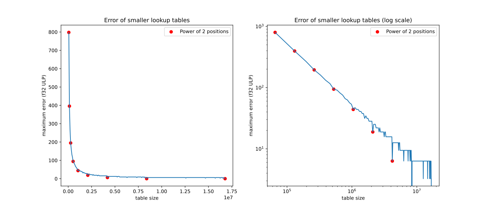
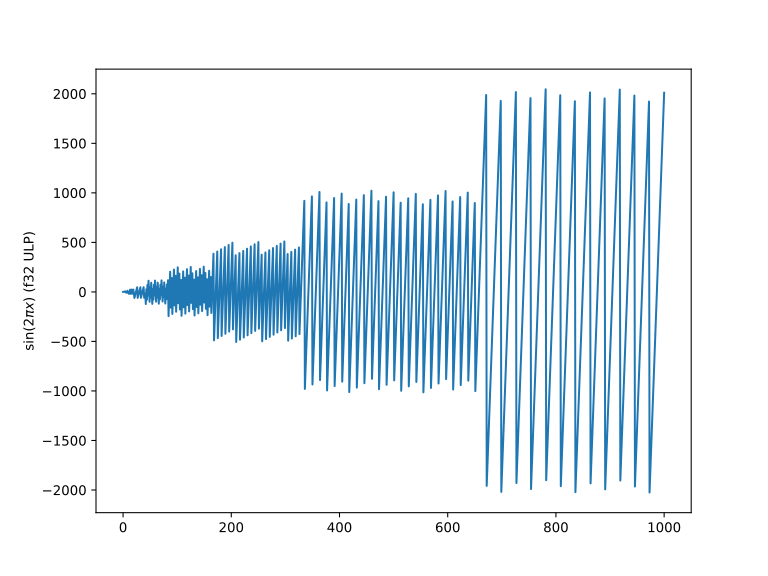
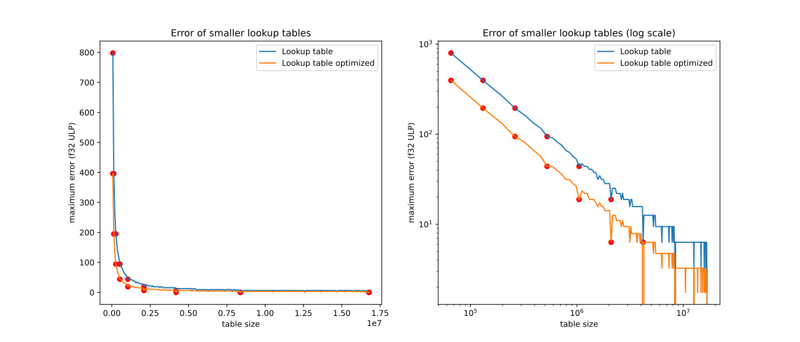
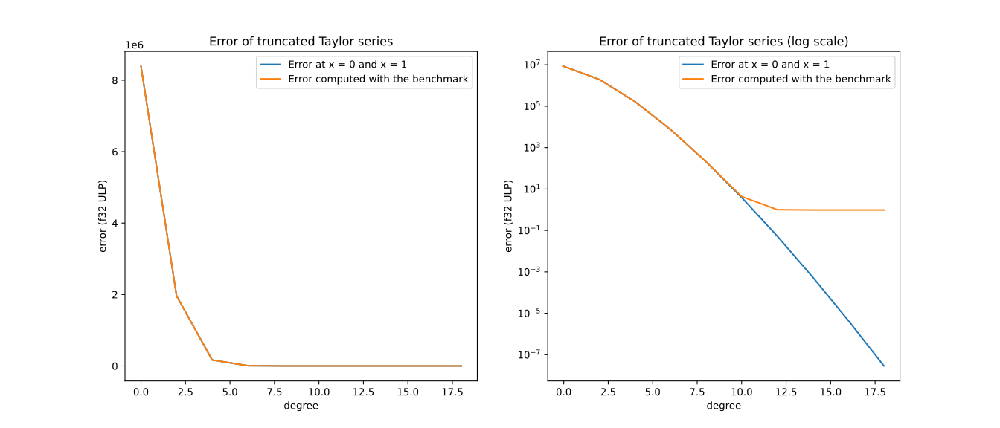
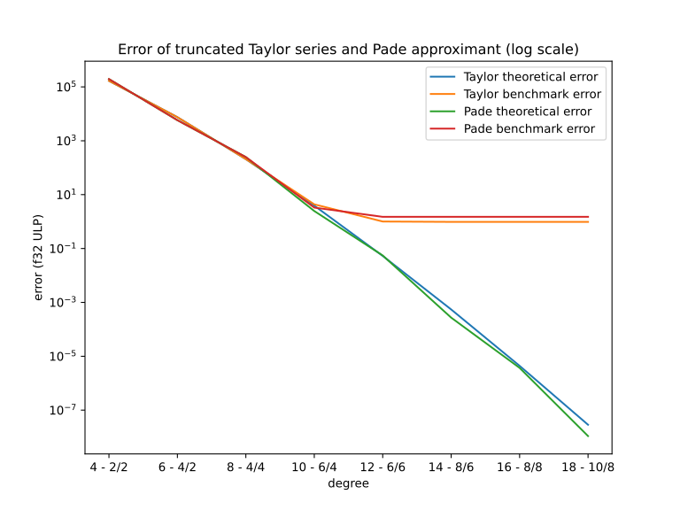
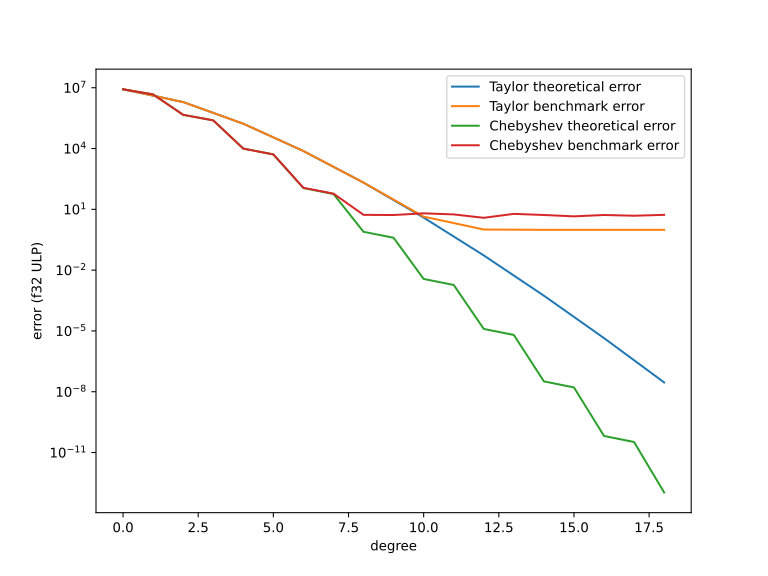

+++
title = "Approximating sin(2πx)"
date  = "2024-11-05"
+++

I use trigonometric functions extremely often, ever since I started doing
programming. They show up everywhere, especially in graphics, and while they're
not the most efficient operation, they are widely available in programming
languages. This is not the case if you're programming in embedded systems or
[WebAssembly](/blog/wasm), so I tried to compute them myself.

<!-- more -->

Trigonometric functions are actually quite similar in both their properties and
their computation. So I'll just write about how I computed sine, and the rest
are similar. I actually prefer cosine, but I have chosen the sine function for
this article because of the iconic sinusoidal wave visualization.

**Update April 2025:** This is my biggest article so far, and there are some
errors in it. For example, my explanation of ULP is wrong, and I used an
absolute error scaled by 1 ULP and not relative error. As of today, I still use
turns as a unit for trigonometric functions, but now I use least squares
polynomial regression at Chebyshev nodes using [QR
decomposition](https://en.wikipedia.org/wiki/QR_decomposition).

# Why sin(2πx) and not sin(x)

A big problem with general trigonometric functions is that they use radians as
input (and as output for inverse trigonometric functions). Radians are
exceptionally great for calculus but fall short when implemented on a
computer. They make it so that common angles are expressed as multiples of pi,
which don't have perfectly accurate floating point representation. They also
make computation much, much more complicated and less accurate.

So what is the alternative? Firstly, the concept of angle should be thought of
as an abstract data type. The internal representation shouldn't mean anything,
and what gives them meaning are their operations. I can represent them with
32-bit unsigned integers where 0 is 0 degree and 2^32 (which is equal to 0) is
360 degree (which is also equal to 0 degree), and everything in between is
interpolated. This method has a name, called BAM (Binary angular measurement),
and was used in [Doom](//doomwiki.org/wiki/Angle) back when floating-point
arithmetic was too expensive.

While BAM is great, and I'm sure to investigate more into them, I'm not willing
to implement some of the algorithm below in fixed-point or integer arithmetic.
So a floating-point representation might be better. Degree is actually a pretty
good contestant with its ability to represent many angles as integers, but it
also has a problem similar to using radians when it comes to computing
trigonometric functions.

## The problem with degrees and radians

To understand the problem, let's try to compute sine. Firstly, it's very hard
to design an approximation that works well in the entire range of input. What
is commonly done is called argument reduction, where you exploit the properties
of the function to transform the range of the input into something more
manageable. For sine, it's its periodicity, or, in more rigorous terms:

```
sin(radians) = sin(radians ± 2π)
sin(degrees) = sin(degrees ± 360)
```

This means that, for example, to compute sine in radians, we just need to
compute sin in the range \[0, 2π\] and map the input to this range. This can be
done by taking the remainder of x and 2π, which is [extremely
complicated](//github.com/ziglang/zig/blob/master/lib/libc/musl/src/math/__rem_pio2.c#L49)
to perform efficiently and precisely. Recall that in radians, common angles are
represented as multiples of pi, which means that to compute the sine of common
angles, you have to first multiply by pi and then divide, wait for it, by pi.
Although these two operations cancel each other, their errors still accumulate.

In the degree world, this problem is slightly mitigated as 360 is an integer,
not a transcendental number, which helps a lot with precision and
implementation complexity, but it's not ideal. What if we have a representation
that can perform argument reduction simply and effectively?

## Enter turn (the measurement)

If I pick an unusual angle measurement, say 225 degrees, how do you make sense
or quantify it? If you're like me, you'd interpret it as being about 60% of a
full angle. In CSS, a unit of angle measurement that uses multiples of a full
angle is called a
[turn](//developer.mozilla.org/en-US/docs/Web/CSS/angle#turn). For example, 720
degree is 2 turns and pi/4 is one eight of a turn. In my opinion, this thinking
in terms of a full angle is more intuitive for both human and computer. 0.75
turns is more comprehensible than 270 degree, and to a certain extent, common
angles can be represented exactly in binary floating-point. But what about
argument reduction, here it is:

```c
float reduced = x - (int)x + (x < 0);
```

The `(int)x + (x < 0)` part can be simplified into a `floor(x)`, but casting
the input to an integer will be handy in the future, and we don't have to use
`floor` from the math library. With degrees or radians, flooring does not
suffice, and you have to use something like `fmod` or optimize it with complex
bit manipulations like what most optimized implementations do. This is why I
tried to compute `sin(2πx)`. `2πx` converts radians to turns, so `sin(2πx)` is
simply `sin(x)`, but parameterized with turns instead of radians.

# Different ways I tried to compute sine

With all the rationale behind turn out of the way, here's my many attempts at
computing sine. Unfortunately, this is where my expertise ended, and I was
wandering in unknown territories. Just a disclaimer, I'm not formally educated
in approximation and numerical algorithms, and I'm not the brightest at math,
so the sections below will contain lots of hand-waving and little rigor.

## Lookup table approach

The easiest way to do something efficiently is to do it inefficiently once and
store the results to look them up later. This is an approach I have used many
times in the past and regularly reach for when solving a new problem.

<figure>
    <video autoplay muted loop>
        <source src="lookup-vis.mp4" type="video/mp4">
    </video>
    <figcaption>An illustration of lookup table approximation with different values of sample points</figcaption>
</figure>

To generate the lookup table (and for almost every other computation), I used
the amazing [mpmath library](//mpmath.org).

```python
import mpmath
from tqdm import tqdm, trange

mpmath.mp.prec = 100

total = 1 << 24
table = [
    mpmath.sin(mpmath.pi * 2 * x / total)
    for x in trange(total + 1, desc="Generating lookup table")
]

filename = "sin-lookup.c"
with open(filename, "w") as f:
    f.write("#include <stddef.h>\n")
    f.write(f"const size_t SIN_TABLE_RANGE = {total};\n")
    f.write(f"const float SIN_TABLE[{total + 1}] = {{\n")
    for entry in tqdm(table, desc=f"Writing lookup table to `{filename}`"):
        f.write(f"  {entry},\n")
    f.write("};\n")
```

On my machine, generating the lookup table took 3 minutes, writing
`sin-lookup.c` took 50 seconds and compiling with `clang -c -o sin-lookup.o
sin-lookup.c` took 40 seconds. Which clocks in at a total of 4 minutes and 30
seconds to compute.

Notice that I added a value to the end because argument reduction converts
positive values to \[0, 1\) and negative values to \(0, 1\], so the entire
range of input is converted to \[0, 1\]. Multiplied with the range, the input
will become \[0, range\] so we need a lookup table of size range + 1.

Computing sine with the generated lookup table is easy, just multiply the
reduced input with the range and index the rounded result into the lookup
table. I also added a reduced range variant to emulate using smaller lookup
tables.

```c
#include <stdint.h>
#include <stddef.h>

extern const int SIN_TABLE_RANGE;
extern const float SIN_TABLE[];

float sin_lookup(float x) {
    x -= (int32_t)x - (x < 0);
    size_t entry = x * SIN_TABLE_RANGE + 0.5f;
    return SIN_TABLE[entry];
}

float sin_lookup_reduced(float x, size_t reduced_range) {
    x -= (int32_t)x - (x < 0);
    size_t entry = (size_t)(x * reduced_range + 0.5f) * SIN_TABLE_RANGE / reduced_range;
    return SIN_TABLE[entry];
}
```

Using lookup tables is very accurate, but other than being horrendously slow to
compute, it also generates a `64mb` binary. And while looking up the table is
cheap, the large table size can cause cache misses, which is bad for
performance when used in a computational pipeline. However, the lookup table
gives me a good reference implementation for me to test other algorithms.
Before that, I tested the correlation between table size and precision for this
method.

## Testing framework

The correct way to test a numerical method is to test it on all floating-point
representation of the input range. Because we reduced the input to \[0, 1\], we
need to test all floating-point representation of numbers between 0 and 1,
which has `2^30` unique values. This is too big for me, so I'll just use the
`2^23` values in the \[1, 2\] range, which is uniformly distributed and matches
the range of the lookup table. For completeness, I'll also subtract the range
by 1 to get a subset of the \[0, 1\] range and test those too.

```c
float compute_error(float sin_impl(float)) {
    float max_error = 0;
    for (uint32_t mantissa = 0; mantissa < 1u << 23; ++mantissa) {
        union {
            uint32_t u;
            float f;
        } buf = { .f = 1 };

        buf.u |= mantissa;

        // x of range [1, 2]
        float x1 = buf.f;

        // x of range [0, 1]
        float x2 = buf.f - 1;

        float target1 = sin_lookup(x1);
        float target2 = sin_lookup(x2);

        float result1 = sin_impl(x1);
        float result2 = sin_impl(x2);

        // Compute the absolute error
        float error1 = result1 > target1 ? result1 - target1 : target1 - result1;
        float error2 = result2 > target2 ? result2 - target2 : target2 - result2;

        // Update the max error
        if (error1 > max_error) max_error = error1;
        if (error2 > max_error) max_error = error2;
    }

    return max_error / FLT_EPSILON;
}
```

The final line `return max_error / FLT_EPSILON` converts the maximum error into
a unit called [ULP](//en.wikipedia.org/wiki/Unit_in_the_last_place). The reason
is that 5 ULP and 10 ULP are easier to display than 5.960464477539062e-07 and
1.1920928955078125e-06. Also, ULP takes into account of the data type, so while
5.960464477539062e-07 is 5 ULP in 32-bit float which is great, but it is a
whopping 2684354560 ULP in 64-bit float which is absolutely horrible.

### Testing smaller lookup tables

<figure>
    
    <figcaption>Results of smaller lookup tables</figcaption>
</figure>

From the figure above, we can see that the error is inversely proportional to
the table size, which is quite predictable. The noise in the graph is due to
the error when interpolating the smaller table when the size is not a power of
two. Although the method converges quite quickly, to reach high enough
accuracy, you need very large lookup tables. For example, to reach sub-20 ULP,
the lookup table needs to have the size of 2^21 or about 2 millions elements.
And the method definitely won't scale well when applied to double-precision
floats.

### Testing standard library sine

To verify my claim about the accumulating error when computing sine, let's test
the standard library implementation of sine on multiple ranges of input, using
the lookup table as our target output.

<figure>
    
    <figcaption>Results of standard library implementation of sin(2πx)</figcaption>
</figure>

As you can see, the error of the standard implementation increases as we go
further away from 0. This confirms the accumulating error of multiplying by 2πx
and then taking the remainder. You might be skeptical as I'm using the lookup
table as a reference, so here's the result of `sin(2πx)` in ULP for x in \[0,
1000\]. Of course, the correct results are zeros, but let's see what the
standard library gives.

<figure>
    
    <figcaption>sin(2πx) according to the glibc standard library</figcaption>
</figure>

Okay, that's quite insane, the error at 1000 is 2010 ULP in 32-bit float which
is 2.4e-3, a number that is definitely not insignificant. This is why we
shouldn't use radians for numerically computing trigonometric functions.

## Improving the lookup table approach

Before trying out other forms of computing sine, I tried to exploit the
symmetry of sine to improve the lookup table method. Recall that:

```
sin(radians) = -sin(radians - π)
sin(turns) = -sin(turns - 0.5)
```

So, instead of computing sin in the range \[0, 1\], we can just compute sin in
the range \[0, 0.5\] and negate the result if x is in the range \[0.5, 1\].
It's more efficient to multiply x by 2 before reduce the argument, compute
`sin(πx)` on the reduced argument and check if the original is divisible by 2.

```c
extern const int SIN_TABLE_RANGE;
extern const float SIN_TABLE[];

float sin_lookup(float x) {
    x *= 2;
    int32_t ix = (int32_t)x - (x < 0);
    x -= ix;
    size_t entry = x * SIN_TABLE_RANGE + 0.5f;
    float y = SIN_TABLE[entry];
    if (ix & 1) y = -y;
    return y;
}
```

If you use half-turn instead of turn, you have effectively reduced an
instruction from the algorithm, but multiplying by two is essentially adding
with itself, and I feel like the inputs are more likely to be in the range in
\[0, 1\) so you have to multiply by 2 anyway. This effectively reduced the
memory usage by half for the same precision, as shown in the figure below.

<figure>
    
    <figcaption>Optimized lookup table compared to the original</figcaption>
</figure>

Or you can look at it in another way: By exploiting the symmetry of sine, we
doubled the precision of the same algorithm, for free. There are ways to
exploit even more symmetry, but we'll look at other methods of implementing
sine first.

## Taylor polynomials

Computers don't understand sine and cosine, but they understand polynomials, so
we can use polynomials to approximate sine. The most basic way of doing this
---which you might have learned from your college calculus course---is to use a
truncated Taylor series. At this point, there will be a lot of math, so I'll
switch to exclusively using radians to explain what I did.

<figure>
    <video autoplay muted loop>
        <source src="taylor-vis.mp4" type="video/mp4">
    </video>
    <figcaption>An illustration of Taylor series approximation with different polynomial degrees</figcaption>
</figure>

Since we're computing sin(πx) in the range \[0, 1\], it's a good idea to
compute the Taylor series around 0.5. A benefit of using Taylor series is that
the highest error typically resides at the boundary, i.e., 0 and 1, so we can
compute the error at those points and compare them to the error observed in the
benchmark. Mpmath already has support for Taylor series, but the function is
simple enough for me to calculate myself.

<figure>
    
    <figcaption>Taylor series of sin(πx) around x = 0.5</figcaption>
</figure>

If the origin is at x = 0.5, sin(πx) becomes an even function, so its power
series consists only of even-degree monomials. Translating this to code is very
straightforward:

```python
import mpmath
mpmath.mp.prec = 100

total = 10
sign = [1, 0, -1, 0] # cos(pi * n / 2)

n = 1
d = 1

coeffs = [mpmath.mpmathify(1)]

idx = 1
while len(coeffs) < total:
    n *= mpmath.pi
    d *= mpmath.mpmathify(idx)
    if sign[idx % 4] != 0:
        coeffs.append(n * sign[idx % 4] / d)
    idx += 1

for coeff in coeffs:
    print(f"{coeff},")
```

That `,` at the end is for easier copying into C code. Unlike the lookup table
approach, this runs instantly, and produces a very small set of polynomial
coefficients. In the C code, we can evaluate the polynomial using Horner's
method:

```c
float sin_taylor(float x, int n) {
    static const float coeffs[] = {
        /* ... */
    };

    x *= 2;
    int32_t ix = (int32_t)x - (x < 0);
    x -= ix + 0.5f; // also subtracts x by 0.5 
    float xx = x * x;
    float y = 0;
    for (int i = n - 1; i >= 0; --i) {
        y = y * xx + coeffs[i];
    }
    if (ix & 1) y = -y;
    return y;
}
```

In production code, it's better to inline the polynomial evaluation instead of
using for loop. But with this code, I could test the error of each truncation
point for the series. Because the power series consists of only even-degree
monomials, every step of Horner's method the result is multiplied by x^2
instead of x. This means that I essentially got double the polynomial degree
for free, which is another aspect of exploiting the symmetry of the sine
function.

<figure>
    
    <figcaption>Results of Taylor series approximation with different truncation points</figcaption>
</figure>

The figure above shows the error of Taylor series approximation, both from
running the benchmark at 32-bit floating-point resolution and from computing
`sin(π)` and `sin(0)` with the polynomial in mpmath. The result confirmed my
hypothesis that the maximum error of the approximation is at the boundary, at
least until the precision ran out.

After degree 14, while the theoretical error keeps decreasing, the actual error
from the benchmark stuck at 0.974121. This is possibly due to the
multiplication and addition error accumulated during Horner's method iteration.
This can be counteracted by computing the polynomial in higher precision before
rounding back to 32-bit. Doing this actually allowed me to achieve perfect
accuracy (0 ULP) for the degree 20 polynomial.

But precision is not everything, and I also cared about optimizing the number
of operations while still retaining high precision. The degree 10 polynomial,
which has only 6 coefficients, has the error of 4.36 ULP, which is better than
the optimized lookup table approach of size 2^21 (with the error of 6.31 ULP).
This is good, but I wanted to reach the saturation point faster.

## Padé approximation

A simple way to improve the Taylor approximation is to convert the truncated
power series into a rational polynomial. This is known as the Padé approximant.
This method simply solves a system of equations to obtain a rational polynomial
that agrees with the original function. It feels magical and cheating to get a
better approximation with the same function by transforming it, but a rational
polynomial can better model the asymptotic behaviour of some functions.

Like for the taylor series, mpmath has support for generating Padé
approximations, and I didn't do it myself this time, unlike the Taylor
approximation, because the procedure is different for each order of the
polynomial. After getting the coefficients, I used some metaprogramming to
generate inlined polynomial evaluations. Since the original series has only
even-degree monomials, its rational approximations also have even-degree
numerators and denominators. So I just skipped every other coefficient for both
and performed Horner's method on strings to generate the polynomial.

```python
import mpmath
mpmath.mp.prec = 100

total = 21
sign = [1, 0, -1, 0] # cos(pi n)

n = 1
d = 1

coeffs = [mpmath.mpmathify(1)]

for i in range(1, total):
    n *= mpmath.pi
    d *= mpmath.mpmathify(i)
    coeffs.append(n * sign[i % 4] / d)

for i in range(1, 11):
    p_coeffs, q_coeffs = mpmath.pade(coeffs[:i + i], i, i - 1)
    
    p_coeffs = p_coeffs[::2][::-1]
    q_coeffs = q_coeffs[::2][::-1]

    p = f"{p_coeffs[0]}"
    for p_coeff in p_coeffs[1:]:
        p = f"({p} * xx + {p_coeff})"

    q = f"{q_coeffs[0]}"
    for q_coeff in q_coeffs[1:]:
        q = f"({q} * xx + {q_coeff})"

    print(f"p = {p}")
    print(f"q = {q}")
```

Here's an example of the order \[6/6\] Padé approximation in C. It agrees with
the Taylor series of order 12, but in terms of computation, it's more expensive
and less precise because of the extra division.

```c
float sin_pade_6_6(float x) {
    x *= 2;
    int32_t ix = (int32_t)x - (x < 0);
    x -= ix + 0.5f;
    float xx = x * x;

    float p = -0.35796583327481520071570877176f * xx + 2.6678684023565382463447255987f;
    p = p * xx + -4.6445942642517333510565497579f;
    p = p * xx + 1.0f;

    float q = 0.003110616546418168353807390627f * xx + 0.041275038573729846286627259614f;
    q = q * xx + 0.29020793629294595836069574203f;
    q = q * xx + 1.0f;

    float y = p / q;
    if (ix & 1) y = -y;
    return y;
}
```

A low-level advantage of rational polynomial approximation over polynomial
approximation is that the numerators and denominators can be computed
independently, which allows for better vectorization and pipelining, even for
scalar value. Compiling with `clang -O3 -march=native` on my AMD Ryzen 7 5800U,
the following assembly code is generated:

```asm
sin_pade_6_6:
    vaddss          xmm0, xmm0, xmm0
    vxorps          xmm1, xmm1, xmm1
    xor             ecx, ecx
    vbroadcastss    xmm2, dword ptr [rip + .LCPI0_4]
    vucomiss        xmm1, xmm0
    vcvttss2si      eax, xmm0
    seta            cl
    sub             eax, ecx
    vcvtsi2ss       xmm1, xmm3, eax
    vaddss          xmm1, xmm1, dword ptr [rip + .LCPI0_0]
    vsubss          xmm0, xmm0, xmm1
    vmovsd          xmm1, qword ptr [rip + .LCPI0_6]
    vmulss          xmm0, xmm0, xmm0
    vbroadcastss    xmm0, xmm0
    vfmadd213ps     xmm1, xmm0, xmmword ptr [rip + .LCPI0_2]
    vfmadd213ps     xmm1, xmm0, xmmword ptr [rip + .LCPI0_3]
    vfmadd231ps     xmm2, xmm0, xmm1
    vmovshdup       xmm0, xmm2
    vdivss          xmm0, xmm2, xmm0
    test            al, 1
    je              .LBB0_2
    vbroadcastss    xmm1, dword ptr [rip + .LCPI0_5]
    vxorps          xmm0, xmm0, xmm1
.LBB0_2:
    ret
```

As you can see, the generated routine compute two polynomial with just 3 SIMD
fused multiply-add operations, each on a vector of 2 floats. This efficiency
somewhat made up for the extra division, but let's see how well this does in
terms of precision.

<figure>
    
    <figcaption>Comparison of Taylor and Padé approximation</figcaption>
</figure>

Although Padé approximation is slightly better when not limited by
floating-point precision, it's worse in the benchmark because of the division
error. This shows that although Padé approximation is considered better than
truncated Taylor series, it's actually a worse numerical approximation method
in limited precision settings. Despite this, the independent computations of
numerators and denominators are great and might help with performance.

## Chebyshev polynomials

The problem with truncated Taylor series is also what allowed me to compute the
maximum error easily: the further away from the center of the approximation,
the bigger the error. This means that the error does not distribute uniformly
across the input range. So Taylor polynomials are good at approximating a
function around a point, not across a range.

<figure>
    <video autoplay muted loop>
        <source src="cheby-vis.mp4" type="video/mp4">
    </video>
    <figcaption>An illustration of Chebyshev approximation with different polynomial degrees</figcaption>
</figure>

One method of finding approximating polynomials across a range is called
Chebyshev approximation. I couldn't wrap my head around the theory behind it,
so I just let mpmath do the heavy lifting. Unlike Taylor series, where you can
just truncate the polynomial to get a lower degree approximation, with
Chebyshev polynomials, you have to make one for every degree.

```python
import mpmath
import numpy as np

mpmath.mp.prec = 100

eps = np.finfo(np.float32).eps

def fn(x):
    return mpmath.sin(mpmath.pi * x)

for degree in range(1, 20):
    poly, err = mpmath.chebyfit(fn, [0, 1], degree, error=True)
    poly = poly[::-1]
    print(f"p = {poly[0]}")
    for c in poly[1:]:
        print(f"p = p * x + {c}")
    print(f"p = {p}")
    print("error:", err / eps)
```

Conveniently, mpmath's Chebyshev approximation also returns the maximum error,
so I had something to compare with the benchmark results.

<figure>
    
    <figcaption>Comparison of Taylor and Chebyshev approximation</figcaption>
</figure>

From the graph above, there are two things that needs attention:

1. Chebyshev approximation is better, I indeed managed to reach the saturation
   point faster, at the cost of the quality of the saturation point.

2. The zigzag shape of the graph indicates that significant drops in error
   occurs when a new even-degree polynomial is reached.

Remember that I'm optimizing for maximum error, not average error, so an
approximation technique that distributes the error more evenly is advantageous.
However, both problems above are the result of the unexploited symmetry of
sine. An n-degree Chebyshev polynomial requires n - 1 Horner's iteration, while
for the truncated Taylor series, it's n / 2 - 1. Less arithmetic operations
mean less accumulating error, which explains why the saturated error of the
Chebyshev approximation is so bad. Similarly, odd-degree polynomials don't add
much because the extra term that makes the function odd can't capture the even
features of the function in the input range.

### Optimizing Chebyshev approximation

So in order to optimize the Chebyshev polynomials, I had to make them either
even or odd. If you have a general polynomial P(x), you can turn it into an
even function by evaluating it at x^2 instead of x, giving P(x^2). So I
generated Chebyshev approximations for sin(π√x) and evaluated it like the
Taylor series.

But there's a problem, sin(πx) is not even around 0, so the Chebyshev
polynomials struggles to fit the function. To remedy this I had to shift the
function by 0.5 similarly to the Taylor polynomials, so this is essentially a
truncated Taylor series with a different set of coefficients. By shifting the
function, we get the equality:

```
P((x - 1/2)^2) = sin(πx)
P(x) = sin(π√x + π/2) = cos(π√x)
```

It's tempting to compute the Chebyshev coefficients to fit the range \[0, 1\],
but we can see that:

```
   0 <=      x      <= 1
-1/2 <=   x - 1/2   <= 1/2
   0 <= (x - 1/2)^2 <= 1/4
```

So I only had to fit the function to the range \[0, 1/4\]. The reduced range
means that it's easier to fit the function with less polynomial terms. This
looks promising, let's see how well it actually does:

<figure>
    
    <figcaption>Comparison of Taylor and improved Chebyshev approximation</figcaption>
</figure>

I finally made something better than the truncated Taylor series. The improved
version reached the same saturation point as the Taylor polynomials, but it
converged slightly faster. But something didn't feel right. I computed sine by
indirectly computing cosine. While there's nothing wrong with that, it's better
if I can compute sine directly.

I had to convert to cosine because I need to transform sine into an even
function, but there's another sine-related even function: the sinc function or
`sin(x)/x`.

```
P(x^2) = sin(x)/x
P(x) = sin(π√x)/√x
sin(πx) = P(x^2) * x
```

Multiplying x by an even function creates an odd function, which is exactly
what sine is. This feels more natural than the approach above and it also
guarantees that sin(0)---and, by extension, sine of integers---zero. The
problem with this method is that unlike the other method, there's no way to
compute the error in mpmath. As a result, I only compared the benchmark results
of the two methods.

<figure>
    
    <figcaption>Comparison between the two Chebyshev approximation methods</figcaption>
</figure>

The odd-degree sinc transformation does slightly worse than the even-degree cos
transformation. For the worse saturation point, it's probably due to the extra
multiplication, similar to the Padé approximation method. For the worse
non-saturated error, however, I can hypothesize that it's due to the additional
complexity of approximating `sin(π√x)/√x` instead of `cos(π√x)`.

Nontheless, I prefer the odd-degree version because it felt more like directly
computing sine and no matter how bad the approximation is, the sine of full
turns is always zero.

# Conclusion

This post summarized the techniques I tried to compute sine, including lookup
tables, truncated Taylor series, Padé approximant, and Chebyshev polynomials.
These methods are nothing new, in fact, mpmath has implemented all these
methods already, and all I did was call functions and evaluate the
results. It was still pretty fun balancing precision, speed, and memory
usage. I still want to learn more about Chebyshev polynomials and try
Remez's algorithm, which is pretty interesting as it uses Newton's method,
another approximation technique.

For the time being, this is what I use for computing sine in turns for
single-precision floating-point numbers. It's the odd-degree Chebyshev method
with internal double conversion to bypass the saturation point. This has the
maximum error of 0.5 ULP.

```c
float sin_turn_32(float fx) {
  double x = fx * 2;
  int64_t ix = (int64_t)(x + 0.5) - (x < -0.5);
  x -= ix;
  double xx = x * x;
  double y = 0.077655912276013869412936155364;
  y = y * xx + -0.59829041128342753490068232851;
  y = y * xx + 2.5500773865289118653040643387;
  y = y * xx + -5.167710076668314409260164949;
  y = y * xx + 3.1415926400772032517452140952;
  if (ix & 1) y = -y;
  return y * x;
}
```

For double-precision, more terms are needed to converge, and unfortunately,
80-bit and 128-bit floating-point numbers are too slow to do the previous
optimization. I'm sure there are other clever ways of achieving this, but
currently the precision has reached the saturation point at 2 ULP.

```c
double sin_turn_64(double x) {
  x *= 2;
  int64_t ix = (int64_t)(x + 0.5) - (x < -0.5);
  x -= ix;
  double xx = x * x;
  double y = -0.000021133627352052970404406818407;
  y = y * xx + 0.00046598701580433779333641383896;
  y = y * xx + -0.0073703643265304156755464627222;
  y = y * xx + 0.082145878816310426916561014931;
  y = y * xx + -0.59926452882522400507990958357;
  y = y * xx + 2.5501640398618676296938350463;
  y = y * xx + -5.167712780049785822740496262;
  y = y * xx + 3.1415926535897928787046988706;
  if (ix & 1) y = -y;
  return y * x;
}
```

It's interesting to benchmark and compare these with the standard library
implementation, but I don't expect it to do better. The benefit of creating my
own sine function is that I now have full control over it and can change it
however I want. If one day I decide that half-turns or degrees are better, then
I can easily switch to those. I can also use a lower-degree polynomial to
increase execution speed at the cost of precision. It's always nice to have the
ability to customize a tool for your needs and preferences.

# Uupdate: Benchmark against the standard library implementation

I couldn't help myself but to conduct some benchmarks to compare my custom sine
implementation with the implementation from the standard library. I'll test
both computing a single value and batch processing an entire array of values.
To generate inputs, I used the [Xoshiro256++](//prng.di.unimi.it/) random
number generators to generate 64-bit values in these value ranges: \[-0.25,
0.25\) and \[-1, 1\) I also tested a SIMD optimized implementation of [Estrin's
scheme](//en.wikipedia.org/wiki/Estrin's_scheme).

```c
double sin_turn_simd(double x) {
    x *= 2;
    int64_t ix = (int64_t)(x + 0.5) - (x < -0.5);
    x -= ix;
    double x2 = x * x;
    double x4 = x2 * x2;
    double x8 = x4 * x4;

    __m256d c0 = _mm256_set_pd(
        -5.167712780049785822740496262,
        -0.0073703643265304156755464627222,
        -0.59926452882522400507990958357,
        -0.000021133627352052970404406818407
    )

    __m256d c1 = _mm256_set_pd(
        3.1415926535897928787046988706,
        0.082145878816310426916561014931,
        2.5501640398618676296938350463,
        0.00046598701580433779333641383896
    )

    __m256d p0 = _mm256_fmadd_pd(c0, x2, c1);
    __m128d p1 = _mm_fmadd_pd(_mm256_extractf128_pd(p0, 0), _mm_set1_pd(x4), _mm256_extractf128_pd(p0, 1));
    double p2[2];
    _mm_store_pd(p2, p1);

    double y = p2[0] * x8 + p2[1];
    if (ix & 1) y = -y;
    return y * x;
}
```

To evaluate the speed of these algorithms, I measured the time it took to
compute 100 million sines. The error is measured against a degree-41 Chebyshev
polynomial operating in 80-bit floating-point.

## Single processing results

Input range \[-0.25, 0.25\):

|        | GCC `-O3`  | GCC `-Ofast` | Clang `-O3` | Clang `-Ofast` | Error       |
| ------ | ---------- | ------------ | ----------- | -------------- | ----------- |
| Horner | 596 ms     | 616 ms       | 593 ms      | 539 ms         | 2 ULP       |
| SIMD   | **587 ms** | 616 ms       | **584 ms**  | **535 ms**     | 2.5 ULP     |
| Glibc  | 1382 ms    | 1394 ms      | 1366 ms     | 1247 ms        | **0.5 ULP** |

Input range \[-1, 1\):

|        | GCC `-O3`   | GCC `-Ofast` | Clang `-O3` | Clang `-Ofast` | Error     |
| ------ | ----------- | ------------ | ----------- | -------------- | --------- |
| Horner | 1131 ms     | 1090 ms      | 1213 ms     | 1108 ms        | **2 ULP** |
| SIMD   | **1102 ms** | **1086 ms**  | **1205 ms** | **1101 ms**    | 2.5 ULP   |
| Glibc  | 1936 ms     | 1937 ms      | 1920 ms     | 1819 ms        | 3.125 ULP |

## Batch processing results

Input range \[-0.25, 0.25\):

|        | GCC `-O3`  | GCC `-Ofast`         | Clang `-O3` | Clang `-Ofast` | Error       |
| ------ | ---------- | -------------------- | ----------- | -------------- | ----------- |
| Horner | **488 ms** | 492 ms               | **461 ms**  | **458 ms**     | 2 ULP       |
| SIMD   | 503 ms     | 503 ms               | 505 ms      | 504 ms         | 2.5 ULP     |
| Glibc  | 1172 ms    | **388 ms** (1.5 ULP) | 1137 ms     | 1247 ms        | **0.5 ULP** |

Input range \[-1, 1\):

|        | GCC `-O3`  | GCC `-Ofast`          | Clang `-O3` | Clang `-Ofast` | Error     |
| ------ | ---------- | --------------------- | ----------- | -------------- | --------- |
| Horner | **930 ms** | 919 ms                | **469 ms**  | **458 ms**     | **2 ULP** |
| SIMD   | 942 ms     | 913 ms                | 944 ms      | 898 ms         | 2.5 ULP   |
| Glibc  | 1753 ms    | **395 ms** (3.25 ULP) | 1743 ms     | 1718 ms        | 3.125 ULP |

## Analysis

Although performance wasn't my primary goal when creating a sine approximation,
it's pleasant to see that my custom implementation is faster than the glibc
implementation. There are many reasons why this is the case:

- The glibc implementation has proper infinity and NaN handling.
- The glibc implementation performs more aggressive argument reduction and
exploits even more symmetry (hence the 0.5 ULP).
- My implementation has a simpler and faster argument reduction procedure.
- My implementation is smaller, possibly making it easier to inline and optimize.

For single processing speed, the SIMD version consistently outperforms the
Horner's method implementation, but only in an insignificant amount. For the
batch processing, however, the SIMD version performs worse due to the fact that
both versions are vectorized anyway and the SIMD version has some extra
overheads. The biggest drawback of the SIMD version is that Estrin's scheme
isn't optimal in terms of the number of operations, so it has more error
accumulation. While the idea is cool and was also pretty fun to implement, the
SIMD version isn't worth it.

My implementations only perform worse than the GCC `-Ofast` optimized glibc
sine in bulk processing. A quick look at the generated assembly revealed that
it directly calls `_ZGVdN4v_sin`, which is a carefully optimized SIMD
implementation of sine in [libmvec](//sourceware.org/glibc/wiki/libmvec).
Overall, I was pleasantly surprised that my implementation is quite efficient
and accurate, and it made me even happier with what I managed to come up with.
