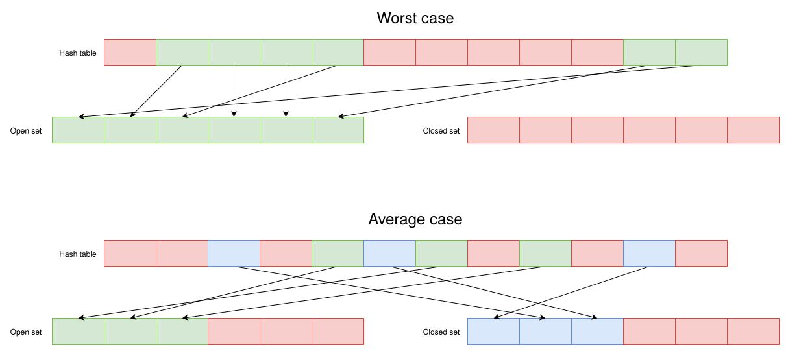
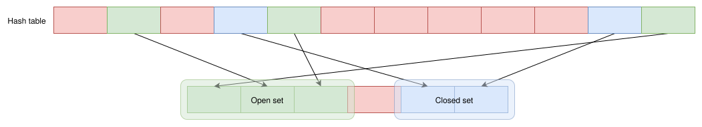

+++
title = "Writing a 15-puzzle solver"
date  = "2025-03-01"
+++

In computer science, the problems that captivate me the most are the ones that
are just a bit more difficult to optimally solve with current hardware
limitations. They often require careful engineering and strategic trade-off
considerations to come up with suboptimal, but good-enough solutions.

One such problem is finding the shortest solution to the
[15-puzzle](//en.wikipedia.org/wiki/15_puzzle). With the state space size of
10^13, average branching factor of 2, and longest solution length of 80, it's
impossible to find the shortest solution using conventional search algorithms.
However, I implemented an algorithm that can optimally solve a vast majority of
random instances pretty quickly.

<!-- more -->

# Background

I used to solve sliding tile puzzles as a kid, and soon figured out that it's
actually quite easy to solve them by breaking them down into smaller subtasks.
Last year, during one of my introductory courses in college, I was introduced
to the problem of finding the shortest solution to sliding puzzles, and how it
can be formulated as a path-finding problem. I was interested, but never got to
do it because back at the time, the thought of implementing custom data
structures (priority queues and hash maps) is too much for me.

A year later, I was confident enough in my ability to [implement data
structures](/blog/2024-wrap-up#implementing-data-structures), so I finally
embarked on a journey to solve this puzzle. It turns out that the challenge was
more than just a priority queue, so this post documents the process of
designing and implementing the solver. Before reading on, I recommend trying
out the final result hosted as a website:
<https://ziap.github.io/sliding-puzzle>.

# Tech stack

Now you might be thinking, what's so hard about a priority queue, they're
already implemented in most standard libraries. For starter, I was planning on
distributing the solver as a website, so I'm left with 2 options: JavaScript,
or WebAssembly. Obviously, the solver is going to be computationally expensive,
so implementing it in JavaScript is out of the window. And I don't just want to
use WebAssembly, I want to use [freestanding WebAssembly](/blog/wasm/).

Using freestanding WebAssembly means that I don't have access to any heap
memory allocator. While I can [implement my own](/blog/arena/), I think that
it's better not to use one, or deeply integrate it into the data structures to
efficiently utilize memory. Thinking back, it's still possible to use some
existing data structures implementation. But writing my own actually led me to
think deeper about the problem, and prompted me to came up with a way to
optimize the time complexity of the solver.

So I need a language for compiling to freestanding WebAssembly. My usual choice
would be to use C, but as [stated before](/blog/2024-wrap-up#heading-to-2025),
I wanted an excuse to write Zig, so decided to use that instead. I'm planning
on replacing C as my "language for WebAssembly", and Zig is a good contender. I
wanted to talk about my thoughts on Zig after this project, but it's out of the
scope of this article. 

To visualize the solver, I needed a web UI, so reached for my favorite web
framework: [vanilla-js](http://vanilla-js.com/). It's 2025, and type-safety is
preached everywhere, so I annotated my JS code with [jsdoc](//jsdoc.app/) and
use `tsc` for type-checking without a build step. I'll talk about the web UI
later, but for now, let's focus on the search algorithm.

# A* search algorithm

Because the problem can be formulated as a path-finding problem, the most
obvious tool for the job is a path-finding algorithm. For the 8-puzzle variant,
the state space is small enough, so a simple Breadth-first search is
sufficient. For 15-puzzle, however, you can't afford to search the entire
search space, so we need a way to guide the search process towards the goal.
Enters A*, which uses a goal-directed heuristic only find the shortest path
from the initial state to the goal state, as opposed to BFS and Dijkstra's
algorithm which finds the shortest-path spanning tree to all possible goal.

To implement A*, two data structures are required: the open set, and the closed
set. The open set stores nodes yet to be explored, along with the estimated
cost of such nodes. The closed set stores a spanning tree from the initial
state to all explored nodes, so when the goal is reached, the spanning tree is
traversed backward to reconstruct the path. The algorithm itself is quite
simple: Each iteration, remove the item with the lowest cost from the open set
and add its neighbors to the closed set if a better path is found. So the hard
part of implementing the A* search algorithm is the representation of the open
and closed set.

## Attempt 1: Naive representation

The most efficient way to implement the set interface is to use hash tables. So
to save memory and for better lookup speed, we can use the same hash table for
both the open and closed set. We can use a boolean to indicate whether the
entry points to the open or closed set.

```zig
const HTEntry = struct {
  in_open: bool,
  index: u32,
};
```

Note that I used a `u32` instead of a pointer because both the open set and
closed set can use array-based data structures. Depending on the `is_open`
field, we can index the correct array to retrieve the node. Note that a boolean
only represent 1 bit of information, but because the alignment is 4 bytes, this
representation actually costs us 31-bit per entry. However, for better
performance, the hash table isn't dense, so we're actually wasting `31 + 64 *
(1 / LF - 1)` bits per entry, where `LF` is the load-factor of the hash table.
I usually use a very low load factor like 50%, so we're wasting `95` bits per
entries, `63` bits more than what is actually needed.

That's only for the hash table. Since I'm not using a heap memory allocator, we
need to figure out the upper bound of how many nodes are stored in either set.
The worse case is that all entries in the hash table points to only one of the
two set, so the capacity of either set must be the same as the hash table. This
means that we're also wasting precious memories for the sets. This can be
further illustrated with the figure below.


<figure>
    
    <figcaption>Illustration of wasted space when using two separate arrays</figcaption>
</figure>

This representation is pretty straightforward, but the memory overhead is quite
concerning, especially when we are wasting `63` bits just to store a boolean. I
was wondering if there is a way to eliminate all aforementioned memory
overhead, and the answer is yes.

## Attempt 2: Heapsort inspired representation

To avoid the wasteful memory usage of that boolean, there are two options:

1. Store the boolean in a separate bitset
2. Use something else to indicate which sets the node belongs to

The second approach is clearly superior, as it doesn't have any memory
overhead. But in order to use it, we need to rearrange our data in a way that
querying for which set a node is in more efficiently. The method that I came up
with is inspired by how [Heapsort](//en.wikipedia.org/wiki/Heapsort) was
optimized to perform without additional memory.

To perform Heapsort in-place, the array is divided into a prefix and a suffix
with different arrangement strategy. During the heapify phase, the prefix is
unsorted, and the suffix is heap-ordered. During the sorting phase, the prefix
is heap-ordered and the suffix is sorted. This dual-arrangement allows the
algorithm to efficiently utilize memory and only the original array is
required, as opposed to requiring two arrays with their own arrangements.

With this in mind, for the new layout, I only use a single array with the same
size as the capacity of the hash table. The array is then divided into three
parts: The prefix, infix, and suffix. The prefix is used to store the open-set,
and is heap-ordered to accelerate finding the node with the lowest cost. The
suffix is used to store the closed-set, and has no meaningful ordering other
than items are inserted backward. The infix is just an auxiliary space, storing
the available memory the prefix and suffix can use. The layout can be
visualized more clearly with the figure below:

<figure>
    
    <figcaption>Visualization of the heapsort-inspired layout</figcaption>
</figure>

Because only a single array is used, the amount of wasted memory is drastically
reduced. We can use two indices (or pointers) to mark the end of the prefix and
the start of the suffix. When the indices cross each-other, we ran out of
memory. The boolean problem is also solved, to tell which set a node belongs
to, we can just compare its index to the marking indices. Now, with the load
factor of 50%, the hash table only costs 64-bit per entry, and the memory usage
of the two sets is reduced by half. It doesn't matter how much memory each set
use, the total amount of memory stays the same and is automatically allocated
to either sets.

This is a very memory-efficient implementation of A*, and I think that I'll use
it for future generic, memory-constrained A* implementations. It's also
surprisingly efficient, but maybe that's just the added benefit of using little
memory and avoid heap allocation (and fragmentation). I used this
implementation for a while until I can make enough assumptions about the
problem to optimize it even further.

## Attempt 3: Uniform-cost graph optimization

For the problem of finding the shortest solution for the 15-puzzle, we are
trying to minimize the number of actions, so the cost of each action is
always 1. This is why we can use BFS for the smaller 8-puzzle variant. Although
A* drastically reduces the number of expanded nodes, the overhead of A* isn't
unnoticeable. With the previous priority queue implementation, each iteration
of A* has the time complexity of `O(log n)`, along with the overhead of moving
nodes around in the array to maintain the heap order, BFS is looking pretty
lucrative not gonna lie.

So how do we combine the efficiency of BFS for uniform-cost graph and the
goal-directed node reduction of A*? I found out a strategy, but it requires a
specific property of the heuristic function: If there is an action from node
`N` to node `P` then `|h(N) - h(P)| = 1`. This means that moving from node `N`
to node `P` only increases or decreases the heuristic by 1. Therefore, the
estimated cost only either stays the same or increase by 2.

This assumption allows us to use a more specialized data structure: [bucket
queue](//en.wikipedia.org/wiki/Bucket_queue). If heapsort is a selection sort
optimized to `O(n log n)` using a binary heap as the data structure for the
priority queue; then [pigeonhole sort](//en.wikipedia.org/wiki/Pigeonhole_sort)
is a selection sort optimized to `O(n)` using a bucket queue as the data
structure for the priority queue. Bucket queue cheats the `O(log n)` lower
bound by using the assumption that the range of priorities fits inside a
predetermined number of buckets.

We established that when the minimum estimated cost is `n`, the estimated cost
of its children is either `n` or `n + 2`. So we can use a bucket queue with 2
buckets to store them. Once the minimum estimated cost became `n + 2`, we need
a bucket to store the node with estimated cost of `n + 4`, but then the bucket
of priority `n` is emptied and can be used for priority `n + 4`. We can use the
previous strategy to store 2 buckets in a single array, but it complicates the
process of reusing buckets, so I decided to just use an array for each bucket.

This implementation is not only theoretically more efficient, but the code is
surprisingly a bit simpler as well. It's only slightly more than regular BFS,
because if you think about it, BFS is Dijkstra's algorithm using a bucket queue
of size 2 as the priority queue. It's time to address the elephant in the room:
What kind of heuristic has that specific property? Both the Manhattan distance
heuristic and the generalized [Additive Pattern Database
heuristic](//arxiv.org/abs/1107.0050) satisfies the property and can be used
with bucket queue.

# Hybrid A* search

So after all these memory and speed optimizations, how fast can the algorithm
solve random instances of the puzzle? The answer is that it can't, because it
will eventually run out of memory. No matter how much we try and optimize the
search algorithm? We can't ignore the fact that 10^13 states requires more than
9.5 TB to store. The pattern database heuristic can reduce the number of
expanded states thousands of times, but even that is still not enough.

One popular non memory-bounded variant of A* is [iterative deepening
A*](//www.cse.sc.edu/~mgv/csce580f09/gradPres/korf_IDAStar_1985.pdf). The
benefit of IDA* is that it's a depth-first algorithm, so it uses memory
proportional to the length of the solution, which is only 80. In practice, less
memory often leads to better cache locality, hence improved performance. So
IDA* oftentimes outperforms A* even in cases where there's enough memory for
A*. IDA* is also much simpler to implement than A*, with the only necessary
data structure being just a stack.

So, is that it, is all my effort optimizing A* for nothing? In fact, I'm quite
glad that I started with A* instead of IDA*. Otherwise, I'd be happy with the
performance of IDA* and stopped investigating further. Luckily, my effort was
not in vain. In a recent (2019)
[paper](//www.ijcai.org/Proceedings/2019/0168.pdf), a hybrid search algorithm
that combines A* and IDA* was proposed and became SOTA for the 24-puzzle. The
gist is that while IDA* typically has lower overhead, it also doesn't consider
duplicate states, which can accumulate quite a lot deeper into the search. A*,
being a dynamic programming based algorithm, is much more effective than using
a generic transposition table.

Because I tried my best to reduce the overhead of A* as much as possible, it
came as no surprise that the hybrid search algorithm is on average 6.5 times
faster (on my machine) than the plain IDA* search. All while being able to
optimally solve all instances of the puzzle, unlike the plain A* version.
Currently, the native version of the algorithm takes on average 40 milliseconds
to solve a puzzle.

# Creating the web UI

After implementing the algorithm and having no more clear path on how to
optimize it, I decided to finally start building the web UI to showcase and
visualize the solver. Because I tried really hard not to use the standard
library, compiling to WebAssembly was a pretty straightforward process. I try
not to put too much effort into the UI because I want to be done with this
project and move on to something else. And I thought that it turned out pretty
okay. The UI was a bit more bland and unintuitive than I'd like to, and the
JavaScript code was all over the place. But I think that it's good enough and
capable of doing what I want it to do.

The biggest challenge is to load a 61 MB pattern database into the website. I
tried to host it as a release, and `fetch` it in the client, but
[CORS](//developer.mozilla.org/en-US/docs/Web/HTTP/CORS) decided that it's not
secure. So without any other options, I gzipped the database into an 18 MB
file, commit it with the rest of the codebase and host it on GitHub pages. I
know that committing large binary blobs is an unforgivable crime, but there's
nothing else that I can do.

Downloading an 18 MB file every time the page loads is also painfully slow. So
I implemented a manual caching system. This is my first time trying out the
[IndexedDB](//javascript.info/indexeddb) API and it was excruciating. The W3C
people really try their best to make doing simple tasks as complicated as
possible. There's also [OPFS](//web.dev/articles/origin-private-file-system),
but somehow I only knew about it right after I'm done with this project. After
dealing with all the nonsense that is the Web API, I finally created a
cross-platform demo of by 15-puzzle optimal solver that's pretty fast and
small.

# Conclusion

That's all there is to how I created a solver for the 15-puzzle. If you haven't
already, check it out [here](//ziap.github.io/sliding-puzzle). This has been a
fun journey, and I haven't even gone in depth into how Zig made it so much more
enjoyable (especially for programming the pattern database heuristic). I
glossed over many parts of the process, because I think that either those are
boring or not unique to my implementation of the solver. But hopefully you can
see what went into the design and implementation of a good-enough solution.
